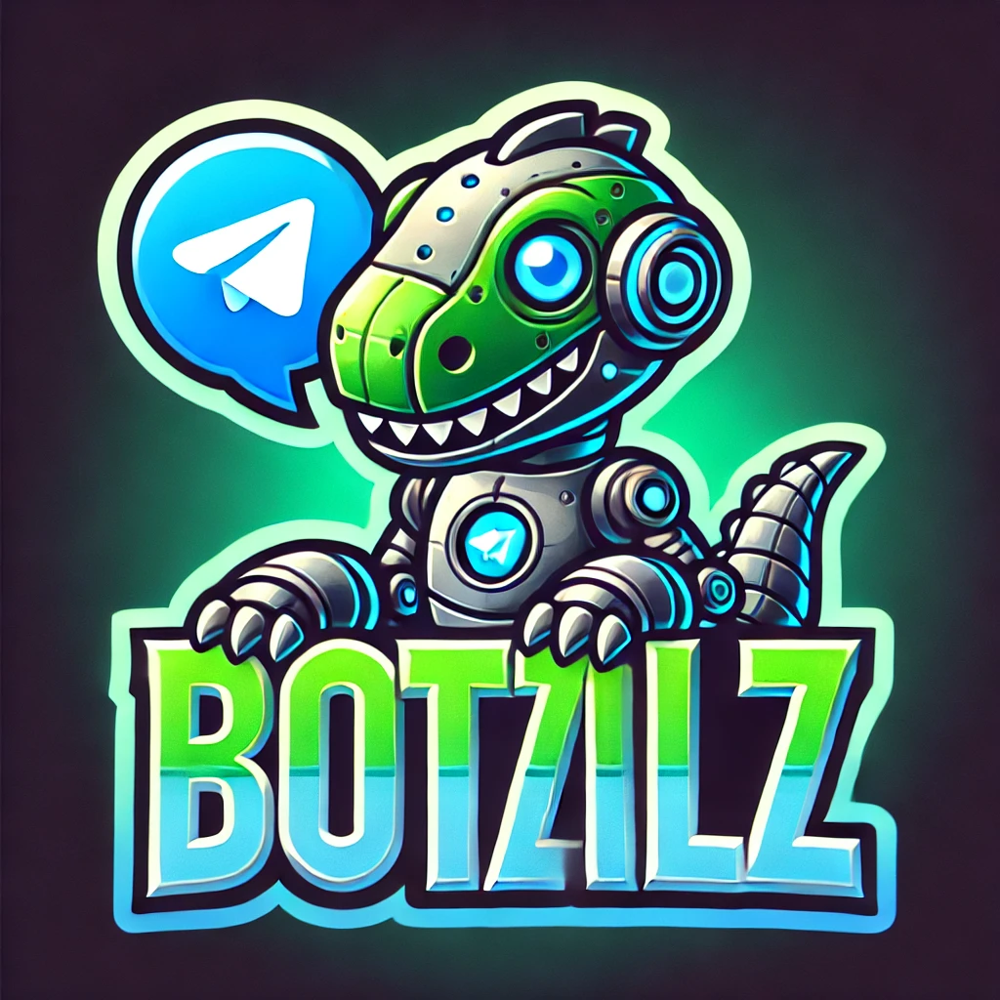

# Botzilla 🦖 - Your Friendly Telegram Chatbot AI Assistant

[](https://opensource.org/licenses/MIT)
[](https://www.python.org/)

Botzilla is a Telegram chatbot powered by [TinyLlama](https://huggingface.co/TinyLlama/TinyLlama-1.1B-Chat-v1.0) and designed to help you with answers, facts, and fun interactions.

## Features 🤖

- **Answer Questions**: Get answers to your questions.
- **Random Trivia**: Enjoy random trivia and fun facts.
- **Friendly Interactions**: Have fun conversations with Botzilla.

## Commands 🦖

- `/start`: Start the bot and view the welcome message.
- `/trivia`: Enjoy random trivia or facts.
- `/help`: Show all available commands.

## Getting Started 🚀

## Installation 🛠️

1. Clone the repository:
    ```sh
    git clone https://github.com/rafoolin/botzilla.git
    ```
2. Navigate to the project directory:
    ```sh
    cd botzilla
    ```
3. Create a virtual environment:
    ```sh
    python3 -m venv botzilla_env
    ```
4. Activate the virtual environment:
    - On Windows:
        ```sh
        botzilla_env\Scripts\activate
        ```
    - On macOS and Linux:
        ```sh
        source botzilla_env/bin/activate
        ```
5. Install the required dependencies:
    ```sh
    pip3 install -r requirements.txt
    ```

## Usage 📦

1. Create a new bot on Telegram by talking to [BotFather](https://core.telegram.org/bots#botfather) and get the API token.
2. Fill in the API token in `config.py`.
3. Run the bot:
    ```sh
    python src/bot.py
    ```
4. Open Telegram and start a chat with your bot.
Don't forget to change the command in BotFather to the following:
    ```
    start - Start the bot and view the welcome message
    trivia -  Enjoy random trivia or facts
    help - Show all available commands
    ```

## License 📝

This project is licensed under the MIT License.